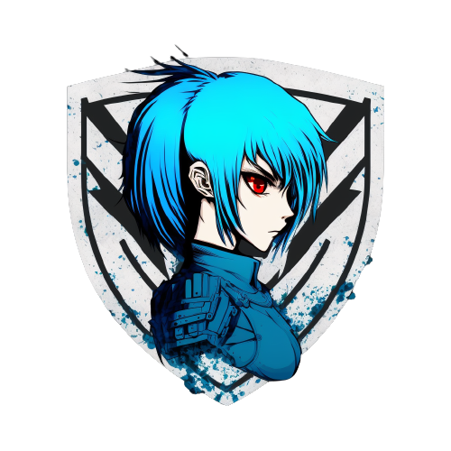

<div align="center">
    
</div>

<h2 align="center">
    The rusty blue team framework!
</h2>

📚 [Documentation](https://docs.rs/crate/catherine/latest)

Catherine is a blue team security framework with an extensible module collection, various types of cryptographic processes, hexadecimal dumping and aggregation, and real-time database analysis. Catherine is as simple as installing via Cargo or using `git` to pull down the source code and immediately start using the framework with `cargo run`. All modules are already built and ready, correlated with the core codebase to work in unison when pulling from source. If you would like to install using Cargo, please refer to the link below.

### Installation
Install via Cargo:
```bash
cargo install catherine
```

Install via GitHub releases:
```bash
curl https://raw.githubusercontent.com/CatherineFramework/Catherine/install.sh | sh
```

NOTE: If installing from Cargo, modules are not currently included. If you would like to have access to all available modules, please follow the installation guide [here](https://github.com/CatherineFramework/Catherine/blob/main/modules/INSTALLATION.md).

## Please Read
Catherine just entered a production (stable) state, so the documentation is currently being built to match these new changes. For now, you can get started by installing via `Cargo` and viewing the help menu within the Catherine shell. If a bug or issue is found, please report it [here](https://github.com/CatherineFramework/Catherine/issues).