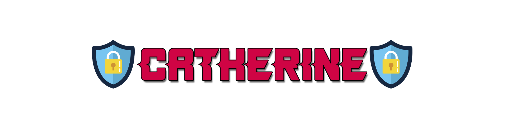

<h1 align="center">
    
</h1>

<h2 align="center">
    The rusty defense framework!
</h2>

<h3 align="center">
📚 <a href="https://catherine-docs.hifumi1337.io/">Documentation</a>
</h3>

<br />

Catherine is a blue team security framework created to make retrieving data, decoding data, and overall defense operations easier. Catherine is currently in a stable beta state, offering cryptographic processes, hexadecimal data collection, real-time database analysis, and much more.

Catherine does depend on custom built [modules](https://github.com/cybersuki/catherine-modules), which are not required, but recommended to enhance the tools at your disposal.

Catherine is now available on Cargo! You can install the executable (+ setup the PATH) by running this command:
```
cargo install catherine
```

## Install
Installing Catherine is easy, all you have to do is run the installer and you're good to go!

First, make sure the installer is setup as an executable:
```bash
chmod +x Catherine_Installer
```

Now run the installation script:
```bash
./Catherine_Installer
```

If you have cURL installed, feel free to run the installer this way:
```bash
curl https://raw.githubusercontent.com/cybersuki/catherine/main/Catherine_Installer | bash
```

Already have Catherine modules installed? Run the installer again to update the modules!

## Issues
If you are unable to run the installation script on WSL, try running these commands first:
```bash
chmod +x Catherine_Installer
```

```bash
sed -i -e 's/\r$//' Catherine_Installer
```
